# Analysis: the mw::com public API — semantics, full call chains, and the QNX primitives underneath

Audience: an engineer new to mw::com. Three parts:

1. **The API** — every public call (`score/mw/com/types.h`, `runtime.h`, `proxy_base.h`, `skeleton_base.h` at pin `0d2f535`) and what it means.
2. **The full chains** — one diagram per main API, from the public call through the internal layers (`impl` → LoLa binding → message passing → `QnxDispatchEngine`) down to the QNX kernel.
3. **The QNX primitives** — each OS call explained on its own, with usage diagram and gotcha.

Ends with the decoded "discovery cross-notifies both sides" walkthrough and a
quick-reference table.

## The mental model in five lines

- You write a **service interface** once: a C++ template listing methods, events, and fields.
- One process instantiates it as a **Skeleton** (the server: owns the data, serves the calls).
- Other processes instantiate it as a **Proxy** (the client: a stub that forwards to the skeleton).
- Code never hardcodes who talks to whom. It names abstract ports (`InstanceSpecifier`), and a JSON **manifest** maps each port to a transport deployment (LoLa/SHM here).
- **Service discovery** is the matchmaker: skeletons announce themselves (`OfferService`), proxies look for them (`FindService` / `StartFindService`), and a returned **handle** is the ticket to connect (`Proxy::Create`).

If you know AUTOSAR Adaptive: this is `ara::com` with the same words and roles.
Skeleton = server side, Proxy = client side, InstanceSpecifier + manifest =
deployment binding, LoLa = the shared-memory binding.

## Part 1 — the API, in lifecycle order

### 1.1 Runtime setup

| API | What it does |
|---|---|
| `runtime::InitializeRuntime(argc, argv)` | Boots the middleware inside the process. Parses `--service_instance_manifest <path>`, loads the JSON manifest, and builds the deployment tables. Must run before any skeleton/proxy is created. Second overload takes a `RuntimeConfiguration` directly. |
| `InstanceSpecifier::Create("repro/instance1")` | Makes a validated name for an abstract port. Returns a `Result` — the string must match the manifest. |
| `runtime::ResolveInstanceIDs(specifier)` | Looks the specifier up in the manifest and returns the concrete `InstanceIdentifier`s it maps to. Rarely needed directly; `FindService`/`Create` do it internally. |

Under the hood: `InitializeRuntime` only parses config and sets up singletons.
No threads toward peers, no shm yet. Each process is self-contained; there is no
central broker daemon.

### 1.2 Defining an interface

```cpp
template <typename T>
struct SimpleService : T::Base
{
    using T::Base::Base;
    typename T::template Method<std::int32_t(std::int32_t, std::int32_t)> add{*this, "add"};
    // also possible:
    // typename T::template Event<MyDataType> status{*this, "status"};
    // typename T::template Field<MyDataType, WithGetter, WithNotifier> config{*this, "config"};
};
using SimpleProxy    = score::mw::com::AsProxy<SimpleService>;
using SimpleSkeleton = score::mw::com::AsSkeleton<SimpleService>;
```

- The template parameter `T` is a trait pack. `AsSkeleton<SimpleService>` stamps the same body out with skeleton traits (each member becomes a real, serving element); `AsProxy<SimpleService>` stamps it with proxy traits (each member becomes a calling stub).
- Members register themselves with the enclosing object at construction (`{*this, "add"}` — the string is the wire name). No code generation, no reflection.
- Element kinds: **Method** (request/response), **Event** (publish/subscribe data stream), **Field** (a value with `WithGetter` / `WithSetter` / `WithNotifier` tags — get it, set it, or be notified on update).
- `GenericProxy` / `GenericSkeleton` are the type-erased variants: they speak to a service without compile-time knowledge of its type (events as raw bytes plus `DataTypeMetaInfo`). Used by tooling/gateways, not by normal app code.

### 1.3 Provider (skeleton) side

| API | What it does |
|---|---|
| `Skeleton::Create(specifier_or_identifier)` | Allocates the service instance: its shared-memory segments and bookkeeping. Returns `Result<Skeleton>`; the object is move-only (it owns OS resources). |
| `method.RegisterHandler(callable)` | Attaches the implementation to a method. Signature style at this pin: `void(ReturnType& result, const Args&... args)`. Register **before** offering, so no call can arrive handler-less. |
| `event.Send(value)` | Publishes a sample to all current subscribers (copy path). |
| `event.Allocate()` + `event.Send(SampleAllocateePtr)` | Zero-copy path: get a slot directly in shared memory, fill it in place, publish it. |
| `OfferService()` | Publishes the instance into service discovery. From this instant, peers can find and connect to it. |
| `StopOfferService()` | Withdraws the offer. Destruction of the skeleton does this implicitly. |

### 1.4 Consumer (proxy) side

| API | What it does |
|---|---|
| `Proxy::FindService(specifier)` | One-shot lookup: "who offers this port right now?" Returns `Result<ServiceHandleContainer<HandleType>>` — zero or more handles, one per live provider. No waiting; poll it if you must. |
| `Proxy::StartFindService(handler, specifier)` | Continuous discovery. Registers a callback `void(ServiceHandleContainer<HandleType>, FindServiceHandle)` that fires **now** with the current offers, and **again on every change** (new offer, withdrawn offer). Returns a `FindServiceHandle`. |
| `Proxy::StopFindService(handle)` | Cancels a `StartFindService` registration. |
| `Proxy::Create(handle)` | Connects to one concrete provider. This is the heavyweight call: it opens the provider's shared memory and performs a synchronous handshake per method (see the chain in 2.4). Returns `Result<Proxy>`, move-only. |
| `proxy.add(2, 3)` | Method call. Synchronous round trip into the provider; returns `Result<MethodReturnTypePtr<ReturnType>>` — the return value lives in shared memory, the ptr keeps its slot alive while you read it. |
| `event.Subscribe(max_sample_count)` | Joins an event stream and reserves `max_sample_count` slots for this subscriber. |
| `event.GetNewSamples(receiver, max)` | Pulls pending samples. The receiver gets `SamplePtr<T>` — a zero-copy view into the provider's data segment; holding it pins the slot. |
| `event.SetReceiveHandler(EventReceiveHandler)` | Push-style notification: "wake me when new samples exist". You still pull with `GetNewSamples`. |
| `event.GetSubscriptionState()` | `kSubscribed` / `kSubscriptionPending` / `kNotSubscribed`. |
| `event.Unsubscribe()` / proxy destruction | Releases the subscription; destruction of the proxy unsubscribes everything it holds. |

Error handling everywhere: no exceptions. Every fallible call returns
`score::Result<T>` (same idea as C++23 `std::expected`) — check `has_value()`,
extract with `.value()`, move-extract with `std::move(r).value()`.

### 1.5 The two transport planes (orientation for Part 2)

- **Bulk data plane: shared memory.** Event/field samples and method arguments/returns live in the provider's shm segments (`/dev/shmem/lola-ctl-…` control, `lola-data-…` data). Readers map them read-only. Zero-copy; nothing is serialized onto a socket.
- **Control plane: message passing.** Subscribe/unsubscribe, method invocation signaling, and update notifications are short messages. Platform-selected in `score/message_passing/BUILD`: `QnxDispatchEngine` (native QNX message passing) on QNX, `UnixDomainEngine` (UNIX sockets) on Linux.

Layer map, top to bottom:

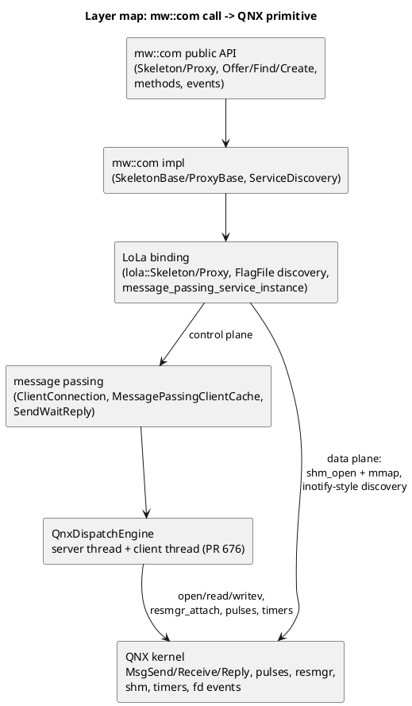

## Part 2 — the full chains: public API → internals → QNX kernel

One diagram per main API. Left-to-right inside each process: app code, then the
internal layers, then the kernel between the processes. All function names are
from the `0d2f535` sources.

### 2.1 Engine startup (lazy, on first control-plane use)

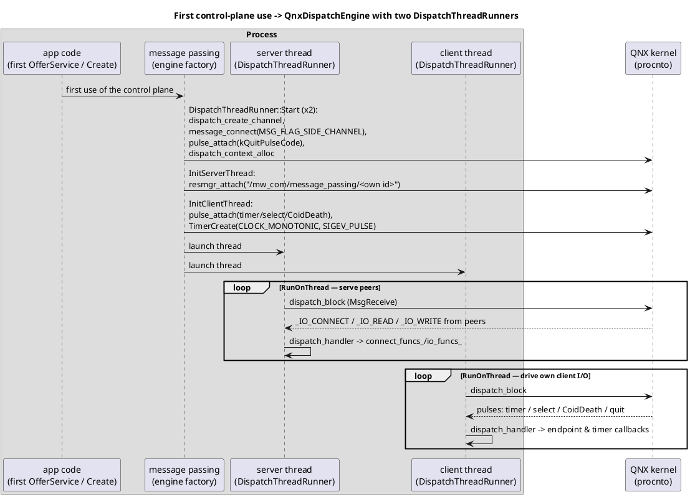

- `resmgr_attach` makes the process callable: its endpoint appears in the pathname space.
- The server thread only answers; the client thread does everything that may block toward peers. This split **is** the PR 676 fix (`analysis_pr676_fix.md`).

### 2.2 `Skeleton::Create` + `RegisterHandler` + `OfferService`

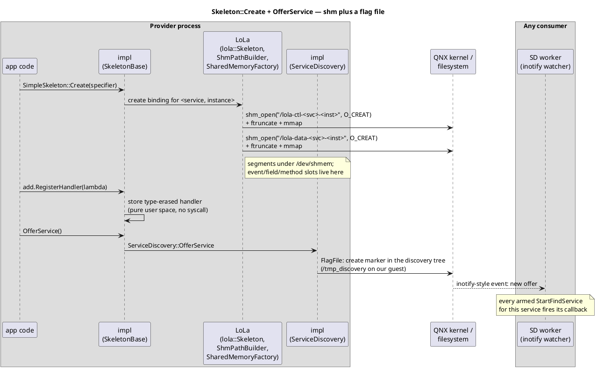

- `Create` costs shm syscalls only; no IPC toward anyone.
- `OfferService` is a **filesystem write**, not a message. Discovery has no daemon; the filesystem is the rendezvous point.

### 2.3 `FindService` / `StartFindService`

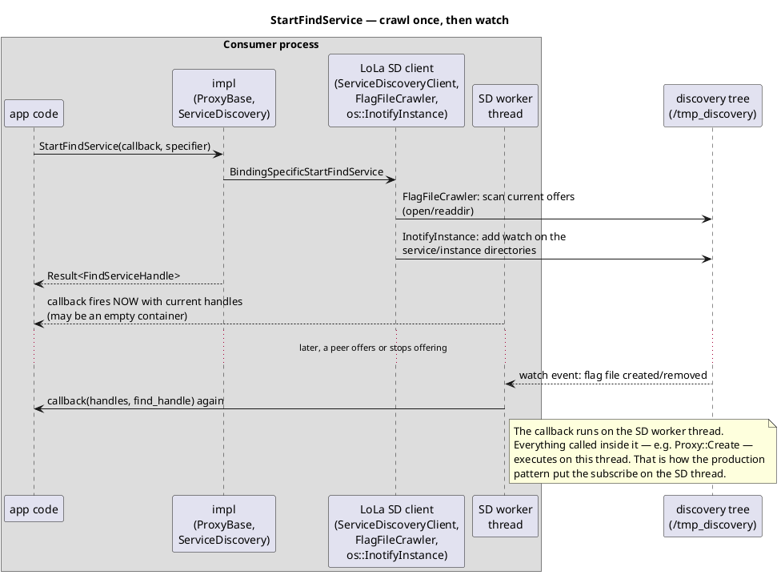

`FindService` (one-shot) is the crawl step without the watch. `StopFindService`
removes the watch descriptors.

### 2.4 `Proxy::Create(handle)` — the heavyweight one

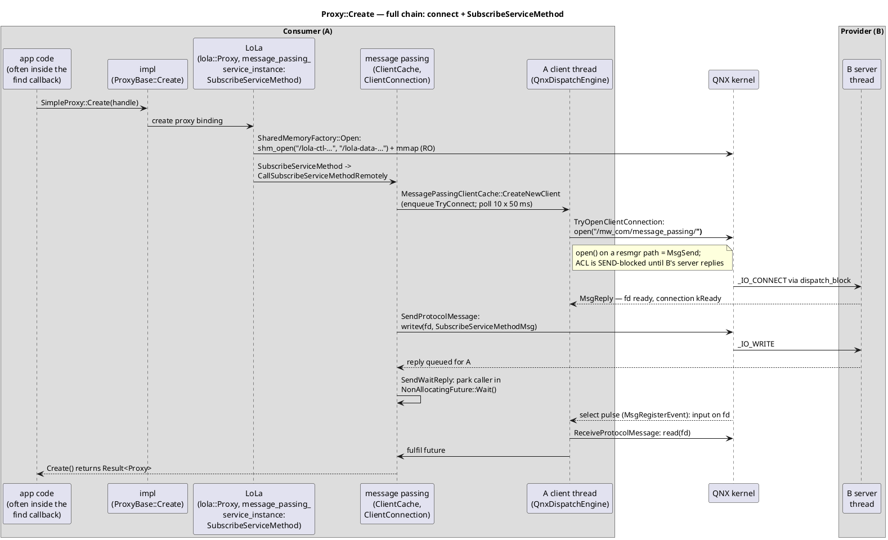

- Two separate blocking round trips (connect, then subscribe per method), both served by B's **server** thread.
- `SendWaitReply` has no timeout; only `CreateNewClient`'s 500 ms poll bounds the connect phase for the caller.
- Pre-PR-676, `ACL` and `BS` were the **same single thread** in each process. Two processes running this chain toward each other simultaneously was the deadlock (`FINDINGS.md`).

### 2.5 Method call — `proxy.add(2, 3)`

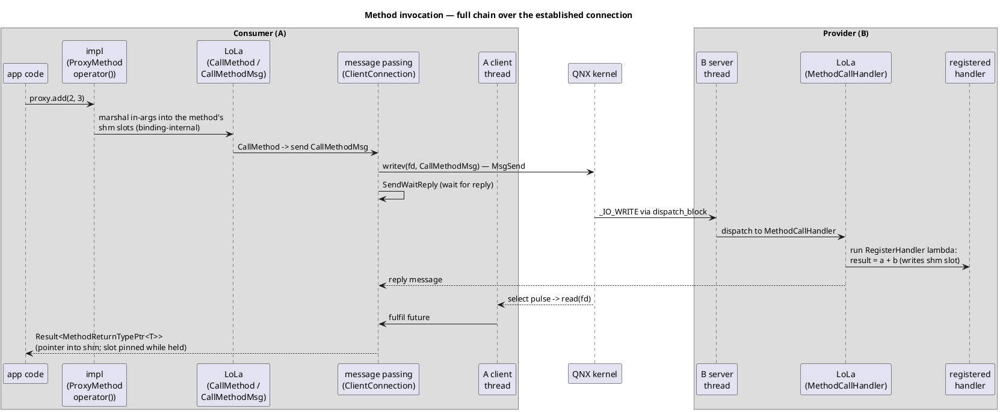

Every crossed pair of these (both sides calling each other in the same instant)
was also a deadlock candidate pre-PR-676 — subscribe was just the most common
first collision.

### 2.6 Events — `Send` / `Subscribe` / `GetNewSamples`

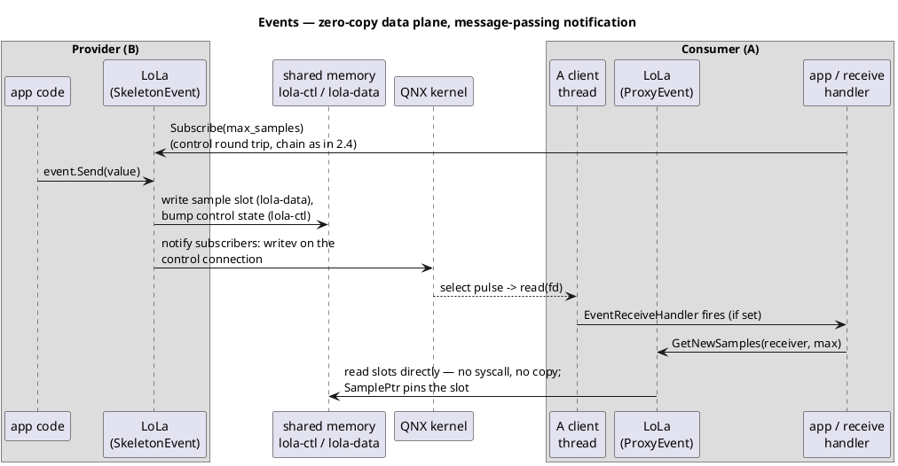

The data plane never touches the kernel after setup — samples are read in place
from mapped memory. Only the *notification* is a message.

### 2.7 Teardown — proxy destruction / `StopOfferService`

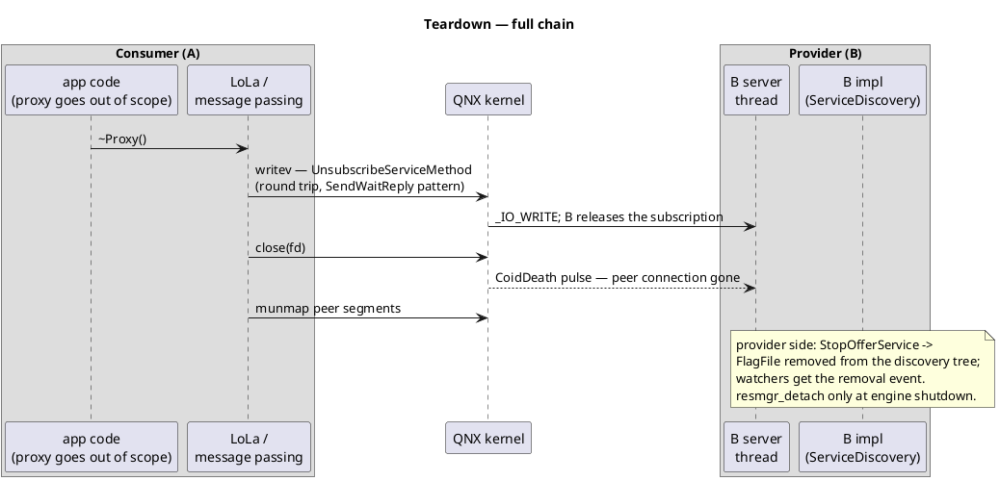

## Part 3 — the QNX primitives, one by one

### 3.1 `MsgSend` / `MsgReceive` / `MsgReply` — the core IPC triangle

QNX native IPC is synchronous rendezvous messaging. A client thread `MsgSend`s
to a channel and the **kernel freezes it** until the server replies. The `pidin`
states tell you exactly where everyone is stuck — which is how we proved the
deadlock.

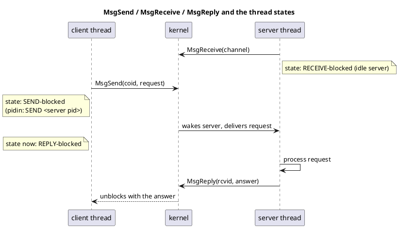

- Used by mw::com for: everything on the control plane — usually hidden under `open`/`read`/`writev` (3.4).
- Gotcha: `SEND` state means "the server hasn't even *received* my message yet". Two threads mutually SEND-blocked on each other (our `pidin` signature) means neither server loop is running — the definition of the deadlock.

### 3.2 Resource manager framework — `resmgr_attach`, `dispatch_block`, `dispatch_handler`

A resource manager is a user-space server that owns a **pathname**. QNX routes
POSIX file operations on that path to the server as messages.

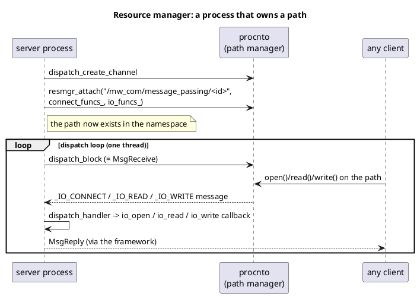

- Used by mw::com for: each process's message-passing endpoint. `SetupResourceManagerCallbacks` fills `connect_funcs_`/`io_funcs_`; `resmgr_detach` removes the path at shutdown.
- Gotcha: with **one** dispatch thread, anything that blocks inside a callback stalls the whole resmgr. That was the pre-676 design flaw: client I/O ran inside this very loop.

### 3.3 Pulses — `pulse_attach`, `MsgSendPulse`, `message_connect`

A pulse is a tiny **asynchronous, non-blocking** message: fixed 8-bit code +
32-bit value, no reply. The sender never blocks; that's their whole point.

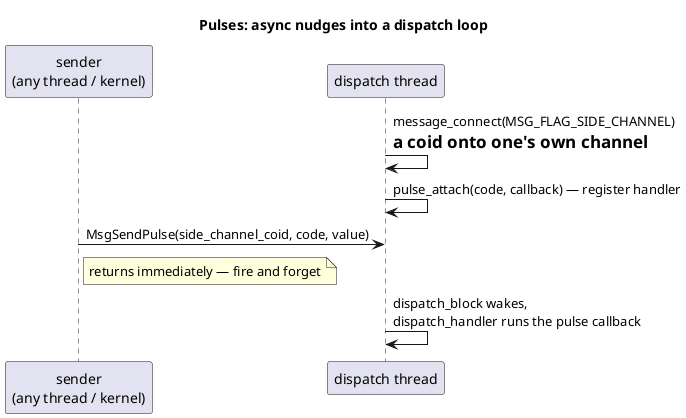

- Used by mw::com for: waking the client thread — timer expiry (`kTimerPulseCode`), fd readiness (`kSelectPulseCode`), peer death (`_PULSE_CODE_COIDDEATH`), shutdown (`kQuitPulseCode`, sent by `DispatchThreadRunner`'s destructor).
- Gotcha: pulses can't carry payloads or wait for results. They say "look", never "here's the data" — the woken thread must then `read()` or check state.

### 3.4 `open` / `read` / `writev` / `close` on a resmgr fd — MsgSend in disguise

The insight that explains the whole bug class:

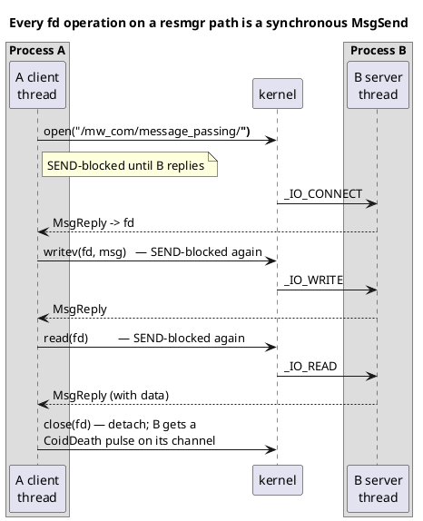

- Used by mw::com for: the entire client side — `TryOpenClientConnection` (`open`), `SendProtocolMessage` (`writev`), `ReceiveProtocolMessage` (`read`).
- Gotcha: these look like harmless POSIX calls, but **each one hands your thread's fate to the peer's dispatch loop**. If the peer's loop never runs, you are SEND-blocked forever — there is no default timeout. This single fact, times two processes, was the deadlock.

### 3.5 Kernel timers with pulse delivery — `TimerCreate` / `TimerSettime` / `TimerDestroy`

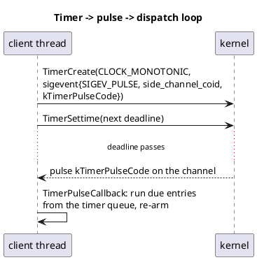

- Used by mw::com for: the engine's timer queue — connect retry backoff (`connect_retry_ms_`), delayed commands. One kernel timer multiplexes all logical timers.
- Gotcha: delivery is a pulse into the **client thread's** dispatch loop; if that loop is blocked (pre-676), timers silently stop firing — which is why even retry/backoff machinery couldn't self-heal the wedge.

### 3.6 fd readiness events — `MsgRegisterEvent` / `MsgUnregisterEvent` / `ConnectServerInfo`

QNX's modern replacement for `ionotify`/`select` loops: ask the kernel to deliver
a chosen sigevent when an fd becomes ready.

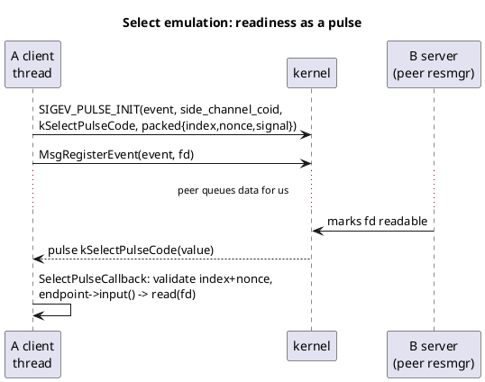

- Used by mw::com for: knowing when a client connection has an incoming protocol message (replies, event notifications) without dedicating a thread per fd. `ConnectServerInfo` sanity-checks a coid/connection; `MsgUnregisterEvent` cleans up in `UnselectEndpoint`.
- Gotcha: the pulse says "readable", the `read()` that follows is still a blocking MsgSend (3.4) — readiness does **not** guarantee the peer's loop will serve the read promptly. The nonce in the pulse value guards against stale pulses for recycled endpoint slots.

## The confusing sentence, decoded

> "A offers its service, discovery cross-notifies both sides at roughly the same
> time — A's find-callback fires its subscribe toward B, and B fires its
> subscribe toward A."

Setup: A and B each **provide one service and consume the other's** (A offers
`instance1` and wants `instance2`; B is the mirror image). Both use
`StartFindService` with a callback that connects as soon as the peer appears.
Timeline when B starts while A is already up:

- A, earlier: `OfferService()` (instance1 is now in the discovery filesystem) and `StartFindService(cb_A, instance2)` (watcher armed, nothing found yet).
- B starts: `OfferService()` — instance2 appears in discovery.
- B: `StartFindService(cb_B, instance1)` — and because `StartFindService` fires immediately with the *current* state, and instance1 is already offered, **cb_B fires right now** with A's handle.
- A's armed watcher sees the new instance2 entry — **cb_A fires** with B's handle.
- Both callbacks do the same thing: `Proxy::Create(handle)` → connect + `SubscribeServiceMethod` → a blocking request *into the other process* (the full chain of 2.4).

That is the "cross-notification": one event (B coming up) makes **both**
processes' discovery callbacks fire within milliseconds of each other, each on
its own service-discovery worker thread, each launching a synchronous call
toward the other. Two blocking calls, in opposite directions, at nearly the same
instant.

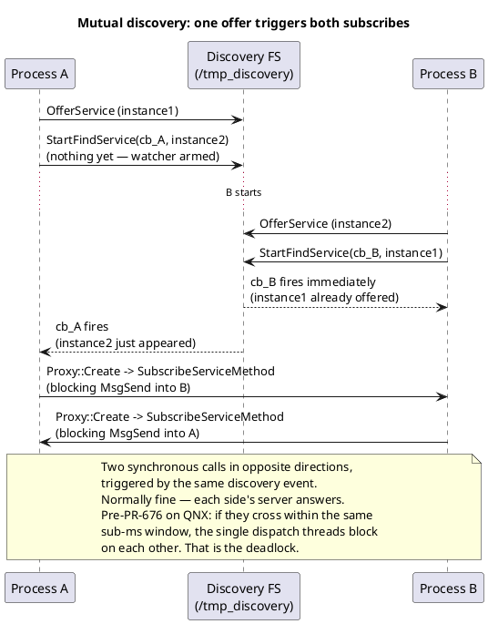

Normal case (>99% of the time): the two round trips interleave harmlessly — B's
server answers A while B's own request is in flight, and vice versa. The
deadlock needed both processes' *single* dispatch threads to be inside their
blocking calls simultaneously, which is why it was sporadic in the field and
why this repo needed a barrier / beat-sweep to force it.

## Quick reference: the whole public surface

| Group | APIs |
|---|---|
| Runtime | `InitializeRuntime` (×2 overloads), `ResolveInstanceIDs` |
| Naming | `InstanceSpecifier`, `InstanceIdentifier`, `InstanceIdentifierContainer` |
| Interface shaping | `AsProxy<T>`, `AsSkeleton<T>`, `Method<Sig>`, `Event<T>`, `Field<T, tags…>`, `WithGetter`, `WithSetter`, `WithNotifier` |
| Skeleton | `Create`, `RegisterHandler`, `OfferService`, `StopOfferService`, `Send`, `Allocate` |
| Proxy discovery | `FindService` (×2), `StartFindService` (×2), `StopFindService`, `HandleType`, `ServiceHandleContainer`, `FindServiceHandler`, `FindServiceHandle` |
| Proxy usage | `Create`, method `operator()`, `Subscribe`, `Unsubscribe`, `GetNewSamples`, `SetReceiveHandler`, `GetSubscriptionState`, `SubscriptionState`, `SamplePtr`, `SampleAllocateePtr`, `MethodReturnTypePtr`, `MethodInArgTypePtr`, `EventReceiveHandler` |
| Type-erased | `GenericProxy`, `GenericSkeleton`, `GenericProxyEvent`, `GenericSkeletonEvent`, `DataTypeMetaInfo`, `EventInfo` |
| Errors | `score::Result<T>`, `com_error_domain.h` error codes |

## Related docs in this repo

- `analysis_simple_app1.md` — line-by-line walkthrough of a minimal app using this API.
- `FINDINGS.md` — the deadlock root cause and reproduction evidence.
- `analysis_pr676_fix.md` — how upstream fixed the threading model.
